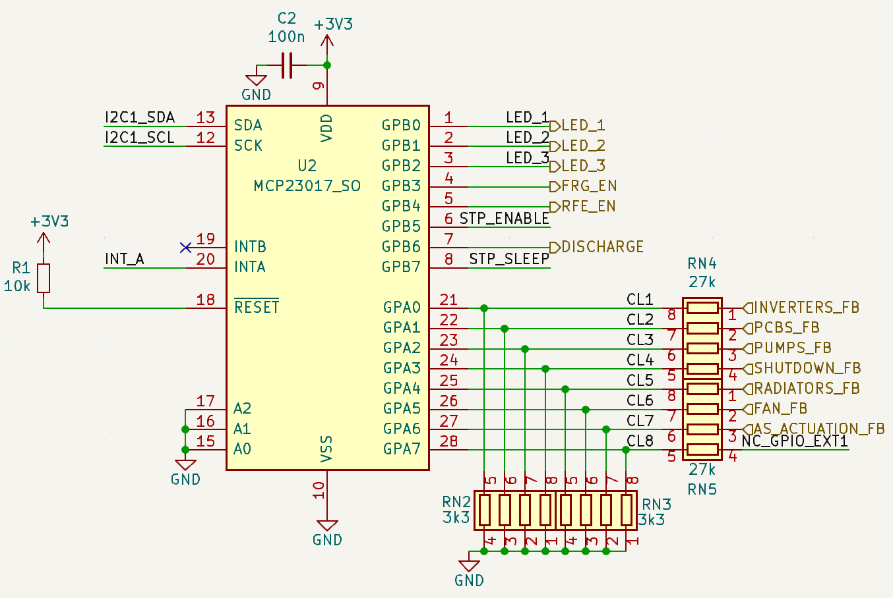
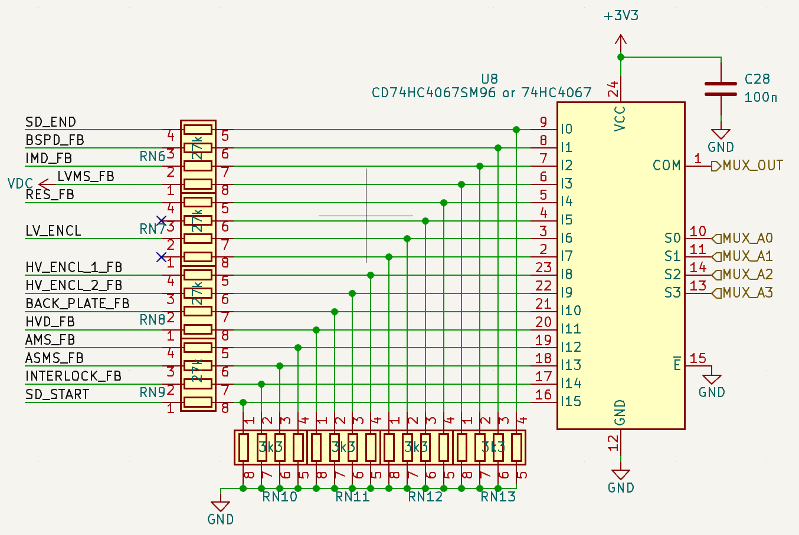

# Feedbacks signals

The IC _MCP23017_ is a _GPIO Expander_, which uses I2C bus to monitor the status of some feedbacks on the board.



List of the feedbacks on board:

- __FB_Inverters__: indicate if LVMS is closed 
- __FB_Pcbs__: indicate if there are 12V on the _DCDC12V_ output
- __FB_Pumps__: depends on FB_12
- __FB_Shutdown__: indicate if the relay is closed or not
- __FB_Radiators__: indicate if there are 24V on the _DCDC24V_ output
- __FB_Fan__: depends on FB_24
- __FB_As_actuation__: depends on FB_12

The shutdown related feedbacks are put on multiplexer _MUX_FB_ is a _GPIO Expander_, which uses I2C bus to monitor the status of some feedbacks on the board.


!!! warning
    You can obtain a specific Feedback value using a specific functions declared in `main.h`
    !!! info
        ```c 
        IMD_FB has become HVD_FB
        HV_ENCL_1_FB has become INVC_LID_FB
        HVD_FB has become INVC_INTERLOCK_FB
        ```