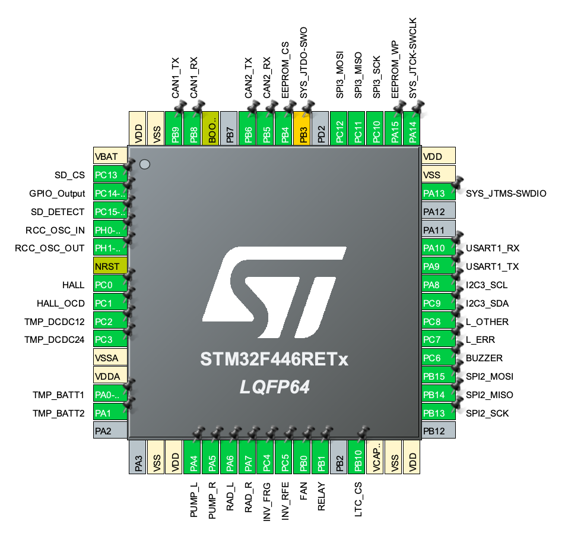

# IOC File and Pinout
The `.ioc` file is the magic tool with the fw-devs can configure the pin functions, the peripherals parameters and the clock of the mcu.

Here are the main pheriperals used in this project:

 - __Can Bus__: to communicate with other devices on board
 - __UART__: to communicate with the user in serial
    - _Baud Rate_: 115200 Bit/s
    - _Word Length_: 8 Bits
    - _Parity_: None
    - _Stop Bits_: 1
 - __DAC__: (Digital to Analog Converter) to control the pumps
 - __ADC__: (Analog to Digital Converter) to read the temperature of the battery and the DCDCs, also used with the current sensing
    - __Current trasducer__: HO-S_SP33-1106 (x1)
        - _ADC used_: ADC1
            - _Channel_: CHANNEL 10
            - _Sampling Time_: 480 Cycles
    - __Temperature sensor__: LM35 (x4)
        - _ADC used_: ADC2
            - __DCDC 12V__
                - _Channel_: CHANNEL 12
                - _Sampling Time_: 480 Cycles
            - __DCDC 24V__
                - _Channel_: CHANNEL 13
                - _Sampling Time_: 480 Cycles
            - __Battery side 1__
                - _Channel_: CHANNEL 0
                - _Sampling Time_: 480 Cycles
            - __Battery side 2__
                - _Channel_: CHANNEL 1
                - _Sampling Time_: 480 Cycles
        
 - __Timers__: to manage time critical tasks
    - __TIM2__: used for Errors time tracking, Measurements, CAN messages
        - <ins>Errors</ins> time tracking: 
            - Channel: _TIM_CHANNEL_4_
            - Mode: : Output compare no output
        - <ins>Measurements</ins>: after the sensing phase the relative message it will be sent via CAN
            - __Cooling__ + __LV_VERSION__
                - Channel: _TIM_CHANNEL_1_
                - Mode: : Output compare no output
                - Timeout (ms): 1000
            - __Current sensing__ + __Inverter status__
                - Channel: _TIM_CHANNEL_2_
                - Mode: : Output compare no output
                - Timeout (ms): 500
            - __Voltage sensing__ + __Temperature sensing__ 
                - Channel: _TIM_CHANNEL_2_
                - Mode: : Output compare no output
                - Timeout (ms): 100
    - __TIM3__: used to generate PWM signal for Right and Left radiators, and internal fan
         - __Left Radiator__
            - Channel: _TIM_CHANNEL_1_
            - Mode: : PWM Generator CH1
            - Frequency: 24 kHz        
        - __Right Radiator__
            - Channel: _TIM_CHANNEL_2_
            - Mode: : PWM Generator CH2
            - Frequency: 24 kHz       
        - __Fan inside the BMS Case__
            - Channel: _TIM_CHANNEL_2_
            - Mode: : PWM Generator CH2
            - Frequency: 24 kHz  
    - __TIM4__: used to check if OPEN WIRE occurs
         - __Open wire check__
            - Channel: _TIM_CHANNEL_2_
            - Mode: : Output compare no output
            - Timeout (ms): 50
    - __TIM5__: used to hardware trigger the ADC
         - __Open wire check__
            - Channel: _TIM_CHANNEL_1_
            - Mode: : PWM Generator no output
            - Frequency: 20 kHz
    - __TIM7__: used as sw interrupt to save ADC values via DMA
        - Channel: _TIM_CHANNEL_1_
        - Mode: : PWM Generator no output
        - Frequency: 1 kHz
    - __TIM7__: used as pwm output for the buzzer
        - Channel: _TIM_CHANNEL_1_
        - Mode: : PWM Generator CH1
        - Frequency: 1 kHz

        

        
