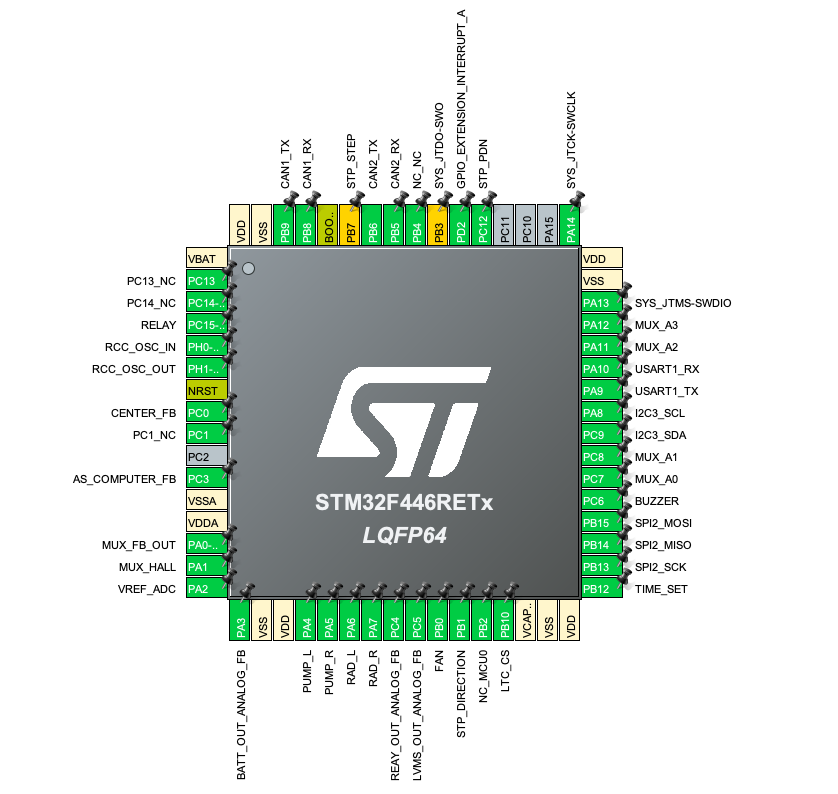

# IOC File and Pinout
The `.ioc` file is the magicn tool with the fw-devs can configure the pin functions, the peripherals parameters and the clock of the mcu.

Here are the main pheriperals used in this project:

 - __Can Bus__: to communicate with other devices on board
 - __UART__: to communicate with the user in serial
    - _Baud Rate_: 115200 Bit/s
    - _Word Length_: 8 Bits
    - _Parity_: None
    - _Stop Bits_: 1
 - __DAC__: (Digital to Analog Converter) to control the pumps
 - __ADC__: (Analog to Digital Converter) to read the temperature of the battery and the DCDCs, also used with the current sensing
 
    | ADC name | Channel   | Signal
    -----------|-----------|--------
    |ADC 2     |Channel 1  |MUX_FB_OUT
    |ADC 2     |Channel 0  |MUX_HALL 
    |ADC 2     |Channel 13 |AS_COMPUTER_FB
    |ADC 2     |Channel 14 |RELAY_OUT
    |ADC 2     |Channel 15 |LVMS_OUT
    |ADC 2     |Channel 3  |BATT_OUT

    - __Measurement reading__:
        - _ADC used_: ADC2
            - __Feedback multiplexer__
                - _Channel_: CHANNEL 1
                - _Sampling Time_: 480 Cycles
            - __Hall multiplexer__
                - _Channel_: CHANNEL 0
                - _Sampling Time_: 480 Cycles
            - __As computer__
                - _Channel_: CHANNEL 13
                - _Sampling Time_: 144 Cycles
            - __Relay out__
                - _Channel_: CHANNEL 14
                - _Sampling Time_: 144 Cycles
            - __LVMS out__
                - _Channel_: CHANNEL 15
                - _Sampling Time_: 144 Cycles
            - __Battery out__
                - _Channel_: CHANNEL 3
                - _Sampling Time_: 144 Cycles
    - __Measurement reading__:
        - _ADC used_: ADC1
            - __ADC vref__
                - _Channel_: CHANNEL 2
                - _Sampling Time_: 144 Cycles
            - __Vref interna__
                - _Channel_: CHANNEL Vrefint
                - _Sampling Time_: 144 Cycles
 - __Timers__: to manage time critical tasks
    - __TIM1__: used for ADC calibration
        - __ADC calibration__
            - Channel: _TIM_CHANNEL_1_
            - Mode: PWM Generator CH1
            - Frequency: 10 kHz 
    - __TIM2__: used for Measurements, CAN messages
        - <ins>Measurements</ins>: after the sensing phase the relative message it will be sent via CAN
            - __Analog signals__
                - Channel: _TIM_CHANNEL_1_
                - Mode: : Output compare no output
                - Timeout (ms): 300
            - __Voltage sensing__ + __Temperature sensing__ 
                - Channel: _TIM_CHANNEL_2_
                - Mode: : Output compare no output
                - Timeout (ms): 200
            - __LV version__ + __Cooling status__ 
                - Channel: _TIM_CHANNEL_3_
                - Mode: : Output compare no output
                - Timeout (ms): 1000
            - __Temperature reading__ 
                - Channel: _TIM_CHANNEL_4_
                - Mode: : Output compare no output
                - Timeout (ms): 5
    - __TIM3__: used to generate PWM signal for Right and Left radiators, and internal fan
         - __Left Radiator__
            - Channel: _TIM_CHANNEL_1_
            - Mode: : PWM Generator CH1
            - Frequency: 24 kHz        
        - __Right Radiator__
            - Channel: _TIM_CHANNEL_2_
            - Mode: : PWM Generator CH2
            - Frequency: 24 kHz       
        - __Fan inside the BMS Case__
            - Channel: _TIM_CHANNEL_2_
            - Mode: : PWM Generator CH2
            - Frequency: 24 kHz  
    - __TIM4__: used to check if OPEN WIRE occurs
         - __Open wire check__
            - Channel: _TIM_CHANNEL_2_
            - Mode: : Output compare no output
            - Timeout (ms): 50
    - __TIM5__: used for Errors time tracking
    - __TIM8__: used as pwm output for the buzzer
        - Channel: _TIM_CHANNEL_1_
        - Mode: : PWM Generator CH1
        - Frequency: 1 kHz
    - __TIM10__: used for ADC readings
        - Frequency: 2 kHz

        

        
