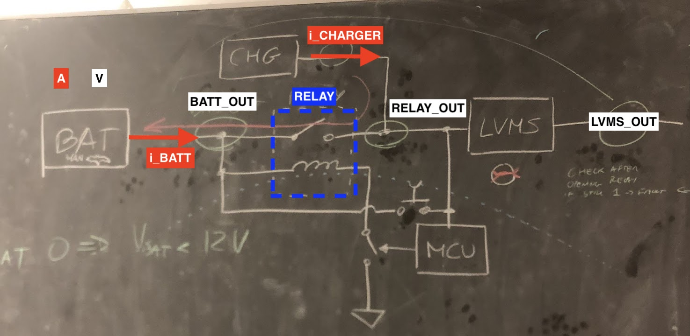

# Health Signals

**"Health signals"** is a bitset composed by the following signals:
<br>Every configuration is reported in the following [google sheet](https://docs.google.com/spreadsheets/d/164IwVTqxkYx0qwMaQI1f49fJukaNQGTxZFFborfOw3s/edit#gid=0). Each configuration can lead the car to a Fault or Non-Fault state.

!!! Note            
    Some configurations that could lead the car to a fault state should not be considered fault at all during the idle state of the BMS LV (when LV BMS is on and LVMS is off). For this reason a shallow check is performed during the idle state of the BMS LV.

|B(7)|B(6)|B(5)|B(4)|B(3)|B(2)|B(1)|B(0)|
| - | - | - | - | - | - | - | - |
|Offset|Offset|Sign(I_battery)| I_Battery | I_Charger | Battery_Voltage_Out | Relay_Voltage_Out | LVMS_Voltage_Out |


<p style="text-align: center;">Schematic of the main health signals</p>

```c
typedef struct PACKED {
    uint8_t lvms_out : 1;              // 0 no voltage after LVMS, 1 voltage after LVMS
    uint8_t relay_out : 1;             // 0 no voltage after Relay, 1 voltage after Relay
    uint8_t battery_voltage_out : 1;   // 0 is above threshold, 1 is below threshold - threshold: MIN_VOLTAGE
    uint8_t charger_current : 1;       // 0 is not charging, 1 is charging
    uint8_t battery_current : 1;       // 0 is not flowing current, 1 is flowing current
    uint8_t sign_battery_current : 1;  // O is negative, 1 is positive
    uint8_t offset : 2;                // 2 bits offset to make it 1 byte long
} health_signals_t;
```

Each signal is set to a high level if it is above a certain level defined by these macros:
```c
#define MIN_CHARGER_CURRENT_THRESHOLD_mA 4000.0f
#define MIN_BATTERY_CURRENT_THRESHOLD_mA 50.0f
#define MIN_BATTERY_VOLTAGE_mV           3300.0 * 6.0f
```

```c
// Min difference threshold between V Relay and V Battery
#define MIN_RELAY_VOLTAGE_DIFF_THRESHOLD_mV 2000.0f  // diff v relay (that could be the charger one and bat out)
// Min difference threshold between LVMS out V ans V Relay
#define MIN_LVMS_VOLTAGE_DIFF_THRESHOLD_mV 2000.0f  // diff lvms out and relay out 5%
#define MIN_LOW_LOGIC_LEVEL_THRESHOLD_mV   500.0f   // 500 mV
```

!!! warning
    **LVMS_OUT** and **RELAY_OUT** are set considering the delta between two voltages (and if both voltages are above MIN_LOW_LOGIC_LEVEL_THRESHOLD_mV)
!!! warning
    **LVMS_OUT** = 1 (1 if V_LVMS - V_RELAY < MIN_LVMS_VOLTAGE_DIFF_THRESHOLD_mV)
!!! warning
    **RELAY_OUT** = 1 (1 if V_RELAY - V_BATTERY < MIN_LOW_LOGIC_LEVEL_THRESHOLD_mV)
